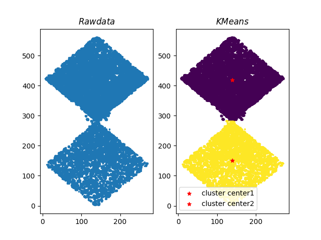
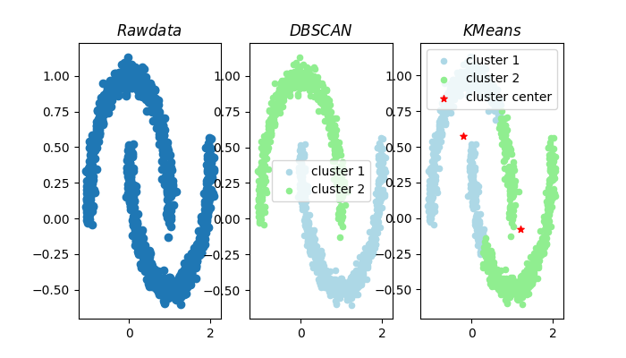
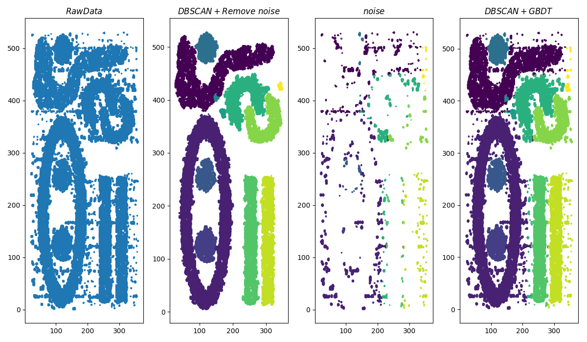
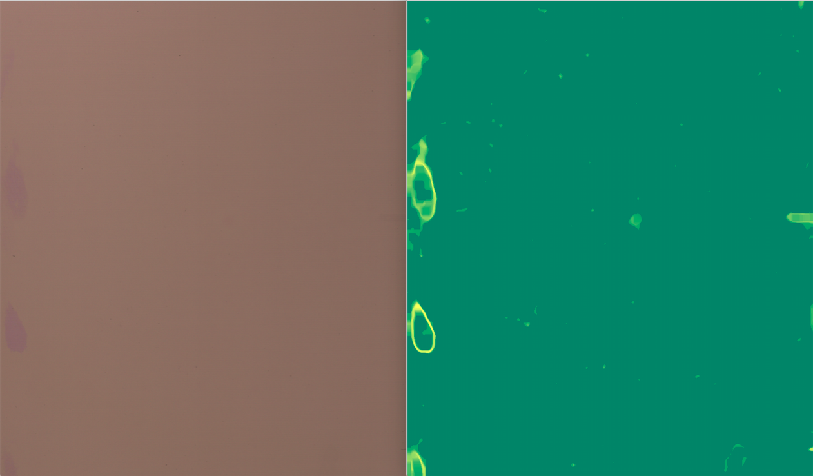
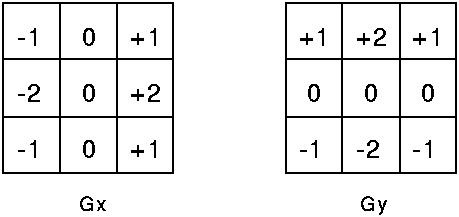

# 作业1:_clustering_

#### 第一题：

+ 使用 __KMeans__ 算法
> 
可见KMeans对本数据处理的非常好
+ 是解决聚类问题的一种经典算法 __Kmeans__ 简单快速高效
+ 对处理大数据集，该算法保持可 __伸缩性__ 和 __高效性__
+ 当簇接近高斯分布时效果较好
> 
KMeans也有明显的缺点例如相比dbscan算法，kmeans对半月形数据集处理效果非常差

#### 第二题：

+ 自行改进的 __DBSCAN__ 算法
_Density-Based Spatial Clustering of Applications with Noise_ ---->  _Density-Based Spatial Clustering of Applications with __Clean up__ Noise_
> 
+ 基于密度定义，相对抗噪音，能处理任意形状和大小的簇
+ 但算法时间复杂度较大

# 作业2: _image matting_

+ 使用hog+grubcut完成智能图像抠图...包没了一块
> 
+ Graph Cut的目标和背景的模型是灰度直方图，Grab Cut取代为RGB三通道的混合高斯模型GMM
+ Graph Cut的能量最小化（分割）是一次达到的，而Grab Cut取代为一个不断进行分割估计和模型参数学习的交互迭代过程
+ hog解决了rectangle的选取问题

# 作业3: _defect detection_

+ 通过 __平均化处理__  __线性变换__ __高斯滤波__ __梯度检测-边缘检测__ __阈值判别__ __中值滤波__ __伪彩色处理__ __膨胀腐蚀__ 完成了 __瑕疵检测__
> 
结果对比非常明显 不仅发现了大的瑕疵 还检测到了可能存在问题的小瑕疵点
+ 原输入图像左右两侧颜色亮度不同 通过平均化处理解决图像两侧的差异
+ 线性变换将灰度图的亮度差异放大
+ 高斯滤波辅助梯度检测 寻找梯度差异较的的地方--->瑕疵
+ 阈值判别完成了像素级瑕疵点的过滤
+ 中值滤波 膨胀腐蚀 某种程度上完成了连通
+ Sobel算子根据像素点上下、左右邻点灰度加权差，在边缘处达到极值这一现象检测边缘。对噪声具有平滑作用，提供较为精确的边缘方向信息，边缘定位精度不够高。当对精度要求不是很高时，是一种较为常用的边缘检测方法

